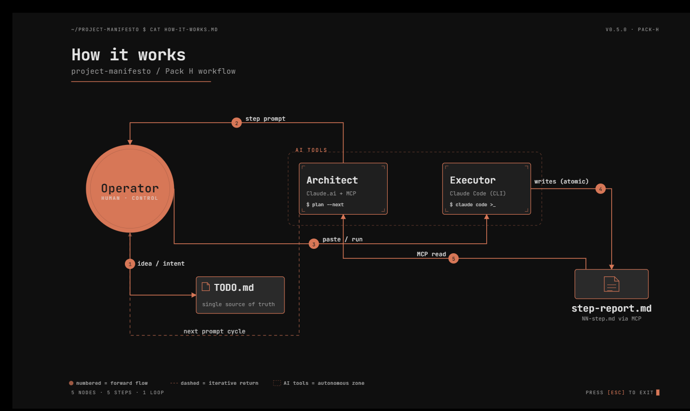

# project-manifesto

> *Workflow rules that turn Claude from a chatbot into a co-worker.*

> A reusable workflow framework for solo founders building technical projects with Claude as their AI assistant.

Drop this manifesto into any new repository. Adapt the project-specific parts through onboarding with your AI assistant. Get out of the way and build.

---

> **Note on Claude focus.** This manifesto's language and onboarding assume Claude as the AI assistant (Claude.ai for the Architect role, Claude Code for the Executor role). The principles are general; readers using other tools may adapt them, but examples and prompts are Claude-shaped because that is what the author uses.

## Why this exists

Most "second brain" systems fail for one simple reason: the human becomes the system administrator.

You start building a project. Then slowly begin maintaining folders, summaries, links, notes, and documentation instead of maintaining momentum.

project-manifesto takes the opposite approach. The Operator is not expected to manually maintain project memory. At the end of a session, it should be enough to say: *"we're done for today."*

The system handles:

- session finalization,
- handoff notes,
- TODO synchronization,
- decision logging,
- and continuation context for the next session.

Next time, the Operator simply asks: *"where did we stop?"*

The goal is not building a better archive. The goal is preserving continuity of thought without turning the human into a librarian.

---

## How it works

The workflow is a controlled loop with the Operator at the center:

1. **The Operator** has an idea, records it in `TODO.md`.
2. **The Architect** (Claude.ai with MCP filesystem access) plans the next step and writes a step prompt.
3. **The Operator** reads the prompt, copies it into Claude Code (the Executor).
4. **The Executor** performs the work and writes a step report to `docs/sessions/{date}-{slug}/NN-step.md` via MCP — atomically, in a single file write.
5. **The Architect** reads the step report via MCP (no copy-paste of terminal output) and plans the next step.

The Operator controls the cycle: reviews every prompt before pasting, reviews every result before signaling "continue", can stop or rewind at any point.

For details see [`MANIFESTO.md`](./MANIFESTO.md) § 2 "Step reports" and § 4 "Workflow roles".

---

## What you get

**`MANIFESTO.md`** — The universal rules.
Four core principles (session types, handoff notes, single TODO, workflow roles) plus a four-tier confidentiality classification system. Project-agnostic. Drop into any repo.

**`templates/`** — Ready-to-fill scaffolding.
- `PROJECT.template.md` — project-specific extension (brand, stack, endpoints)
- `TODO.template.md` — standard task tracker structure
- `README.template.md` — boilerplate for new project READMEs
- `session-log.template.md` — per-session log structure
- `memory-edit.template.md` — for AI memory notes
- `CLAUDE.template.md` — context file for Claude Code at the project root; copied in as `CLAUDE.md` during onboarding
- `pause-checkpoint.template.md` — pause checkpoint for Pack R when the Executor halts mid-step
- `director-skill.template.md` — project-agnostic activation template for the optional Director role

**`onboarding/`** — Conversational project setup.
- `questions.md` — the question set an AI uses to onboard a new project
- `PROMPT.md` — a ready-to-paste prompt you give your AI assistant
- `workflow.md` — how the onboarding flow works step by step

**`examples/`** — Anonymized real-world adoptions (added over time).

**`scripts/`** — Automation helpers (placeholder for future skill).

---

## How to use it

### Option A — Manual adoption (5 minutes)

1. Copy `MANIFESTO.md` into your project's `docs/` folder.
2. Copy `templates/PROJECT.template.md` to your project root as `PROJECT.md` and fill it in.
3. Copy `templates/TODO.template.md` to your project root as `TODO.md`.
4. Create `docs/sessions/` folder for session logs.
5. Read the manifesto with your AI assistant and start working.

### Option B — Conversational onboarding (15 minutes)

1. Clone or download this repository into your new project.
2. Open Claude.ai.
3. Paste the contents of `onboarding/PROMPT.md`.
4. Answer the questions the AI asks (about your project — name, stack, phase, etc.).
5. The AI generates your `PROJECT.md`, initial `TODO.md`, and project `README.md` from the templates.

### Option C — Coming later (not yet built)

A packaged skill (Claude skill, ChatGPT GPT, or CLI tool) that would handle Option B automatically: one command, answers, configured project. **Not implemented yet** — use Option A or Option B for now. Contributions welcome.

---

## Core principles at a glance

**Session types.** One mode of work per session, not per day. A day may contain several sessions of different types: Coding, Thinking, or Discovery. Mixed is a last resort for work that genuinely cannot be split.

**Handoff notes.** Every session ends with a 5-minute log. Saves 30 minutes of context recovery next time.

**Step reports.** For multi-step tasks, the Executor writes each step's report to a file the Architect reads via MCP. No copy-paste of terminal output between AI roles. *(Pack H, added in v0.3.0.)*

**Pause checkpoints.** When the Executor halts mid-step to await Operator input (review of output, confirmation before destructive operation, decision among continuations), it writes a pause checkpoint file alongside the step reports. The file is the canonical record of state at the moment of pause; terminal output is fragile. *(Pack R, added in v0.6.0.)*

**Model selection.** Tasks are classified into three complexity tiers (Mechanical / Standard / Architectural), each with a default model (`haiku` / `sonnet` / `opus`). The Architect classifies once per task; the Operator switches model once at task start via `/model`. Two failed attempts → Executor signals escalation; Operator decides whether to switch model or rewrite the prompt. *(Pack K, added in v0.5.0.)*

**Single TODO.** One file, always synced. No parallel lists in chats or notebooks.

**Workflow roles.** The Architect (AI strategist) plans. The Executor (AI with code access) builds. The Operator (you) bridges them.

**Director (optional).** Larger projects benefit from a state-auditor distinct from the Architect. Director reads project state via filesystem on demand and produces state reports, focused notes for Architect, mild observations, or recommendations when explicitly asked. Director never plans, writes, or mutates. Activated explicitly by the Operator. Small projects do not need it. *(Added in v0.6.0.)*

**Confidentiality.** Four tiers — PUBLIC, INTERNAL, CONFIDENTIAL, SECRET. Each has explicit rules for where it can live and where it cannot.

Full details in [`MANIFESTO.md`](./MANIFESTO.md).

---

## Why roles are structured this way

The split into **Operator / Architect / Executor** is not just for workflow clarity. It is also a deliberate attempt to preserve human creative control over the work, which matters because copyright protection of AI-assisted creative output requires human authorship in most jurisdictions — and the legal treatment of this question is **still a grey area**.

This manifesto is one practical attempt to keep the human at the center of the creative chain. Useful as a workflow even if the legal question never comes up. A reasonable defensive posture if it does.

Details and references in [`RATIONALE.md`](./RATIONALE.md). *This is not legal advice.*

---

## Who this is for

- **Solo founders** building technical products with AI assistance.
- **Small teams** (2-5 people) who want a lightweight workflow standard.
- **Indie developers** juggling multiple projects who keep losing context.

It is probably **not** the right fit for:
- Large engineering organizations with formal processes
- Teams that already use heavyweight frameworks (Scrum, SAFe)
- Projects that do not involve AI assistance at all

---

## Versioning

The manifesto follows [semantic versioning](https://semver.org/):

- **Major** version: changes that break existing project adoptions (e.g., restructuring roles)
- **Minor** version: new sections or principles added (existing rules untouched)
- **Patch** version: clarifications, typos, examples

See [`CHANGELOG.md`](./CHANGELOG.md) for the full history.

---

## Contributing

This manifesto reflects one founder's workflow. Your context will differ.

Acceptable contributions:
- Examples of adoption in different project types (anonymized)
- Clarifications where the rules are ambiguous
- New templates that follow the existing pattern
- Translations (with attribution)

Acceptable extensions to the role model:
- Additional roles that fit the existing chain: Operator instructs → tool or collaborator acts → Operator validates
- Examples include Tester (human or AI) and additional Team members with named scopes — but the model is open to any role that fits the chain

Probably-not-accepted:
- Changes that move creative authority away from the human Operator (the role split exists to preserve human control — see [`RATIONALE.md`](./RATIONALE.md))
- Replacing the four-tier confidentiality model
- Project-specific advice (this is a framework, not a guide)

Open an issue first to discuss before opening a pull request.

---

## Author

**Yury Kuchinsky** ([@kucher32](https://github.com/kucher32))

Built and refined while working on solo founder projects. Released to help others avoid the same coordination overhead.

---

## License

MIT — see [`LICENSE`](./LICENSE).

You may adapt, redistribute, and use commercially without restriction. Attribution appreciated but not required.
