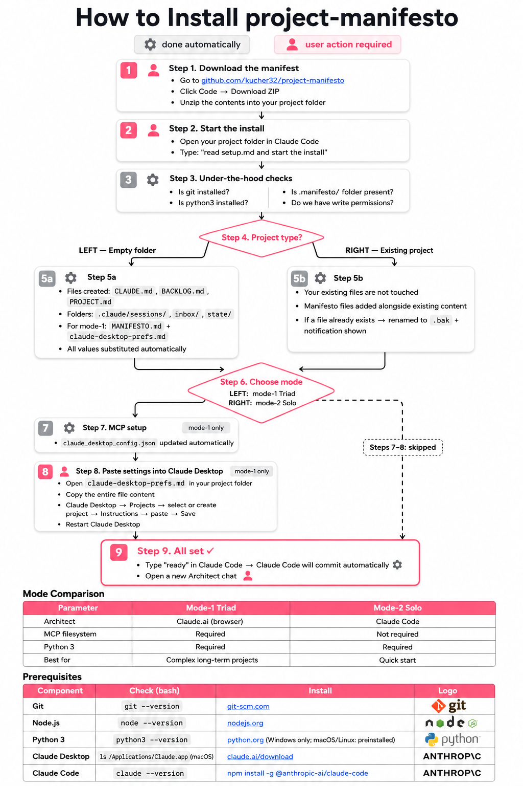
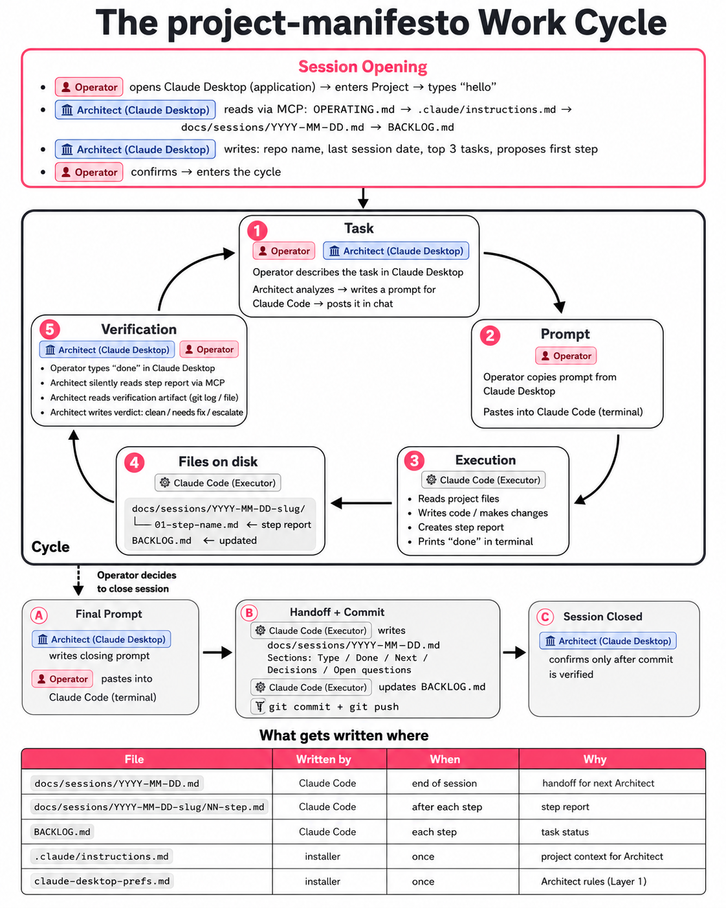

# project-manifesto

   

project-manifesto is a set of working rules for collaborating with AI on technical projects. It enforces a discipline that keeps state, decisions, and progress visible across sessions — so you don't lose context when a chat ends or a new session opens. It installs into your project as a small set of files and tells your AI assistant how to behave from the first message forward.

## Where this came from

I built this while working on my own projects and got tired of losing context between AI sessions. After a while the working rules stabilized enough that I packaged them into something other people could install. We still run this on real work — that's why updates keep coming. If something breaks we hit it ourselves, so fixes land quickly.

## What problem it solves

AI sessions end and take their context with them. Decisions made in yesterday's chat get re-litigated. Work fragments across windows and models. project-manifesto fixes this by requiring every step to write a report, every session to write a handoff, and every decision to land in a state-record file. The next session picks up from the file, not from memory.

## Install

Clone or download the repository from [github.com/kucher32/project-manifesto](https://github.com/kucher32/project-manifesto), copy the contents of `deploy/v0.8.0/` into your project folder, open the folder in Claude Code, and tell it: "read setup.md and install."

The installer walks through prerequisites (git, Python 3, Node.js), asks you to choose a mode (Triad or Solo), copies and substitutes template files into your project root, and writes the MCP filesystem entry to Claude Desktop config. Takes a few minutes on a clean machine.

## How it works after install

The daily workflow has three participants. You are the Operator — you decide what gets built, review every step, and control what moves forward. The Architect is a Claude Desktop session with MCP filesystem access to your project; it reads your session files, plans steps, and writes prompts. The Executor is Claude Code; it runs the prompts, writes step reports back to disk, and waits for your signal before continuing. The Architect reads the reports through MCP rather than having you paste terminal output.

Mode-2-solo skips Claude Desktop and lets Claude Code handle both planning and execution. Lower setup cost, less discipline enforcement.

Strict triad discipline has a practical side effect: Claude never appears in your git history. All commits go through the Executor under your identity. The moment Claude writes files or commits directly, GitHub adds it as a co-author. The role boundary prevents this automatically.

Another side effect: the Architect picks the Executor's model per step — Haiku for mechanical edits, Sonnet for typical work, Opus only when reasoning depth justifies it. The framework routes by complexity tier, so cheaper models run the mechanical majority. Token economy follows from the discipline, not from manual cost-watching.

## We use this ourselves

This isn't a framework someone designed once and forgot. I run it on real projects daily. Mode-1-triad is the one I use. The step report format, the MCP config, the installer — these all came from hitting problems in actual use and fixing them. The commit history reflects that.

## Tested on

I've installed and run this on Windows 11 with WSL2 Ubuntu 24.04, using git 2.43, Python 3.12, Node.js v22, Claude Code v2.1.150, and current Claude Desktop. Mode-1-triad is what I use daily. Mode-2-solo is wired up in setup.md and should work, but I haven't run a full install test on it. macOS, native Linux, and native Windows have code paths in the installer, but none of them have been through a real test run on my side. If you try one of those, let me know what breaks.

## Repository layout

- `deploy/v0.8.0/` — the installer package; copy this into your project
- `.manifesto/` — template source files that the installer reads
- `docs/` — design notes, session logs, issue records
- `promo/` — diagrams and prompts used to generate them

## Links

[github.com/kucher32/project-manifesto](https://github.com/kucher32/project-manifesto) — MIT license
